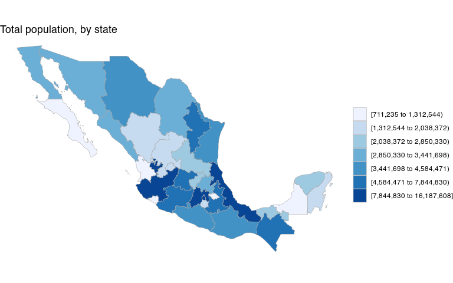
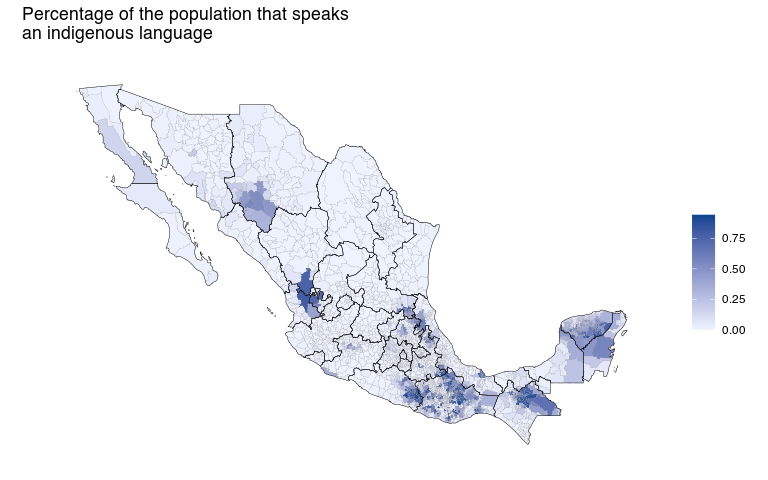

Mexico Choropleths
================
Diego Valle-Jones
February 03, 2021

  - [What does it do?](#what-does-it-do)
  - [Installation](#installation)
  - [Quick Example](#quick-example)
  - [Municipios](#municipios)

Master: [](https://github.com/diegovalle/mxmaps/actions)
[](https://coveralls.io/github/diegovalle/mxmaps?branch=master)

|              |                                                                    |
| ------------ | ------------------------------------------------------------------ |
| **Author:**  | Diego Valle-Jones                                                  |
| **License:** | [BSD\_3](https://opensource.org/licenses/BSD-3-Clause)             |
| **Website:** | <https://www.diegovalle.net/mxmaps/>                               |
| **Forum:**   | [https://groups.google.com/forum/\#\!forum/mxmaps](Google%20Group) |

## What does it do?

This package is based on
[choroplethr](https://CRAN.R-project.org/package=choroplethr) and can be
used to easily create maps of Mexico at both the state and municipio
levels. It also includes functions to create interactive maps using the
leaflet package, map INEGI data from its
[API](https://CRAN.R-project.org/package=inegiR), and format strings so
they match the INEGI state and municipio codes. Be sure to visit the
[official website](https://www.diegovalle.net/mxmaps/).

## Installation

For the moment this package is only available from github. For the
development version:

``` r
if (!require(devtools)) {
    install.packages("devtools")
}
devtools::install_github('diegovalle/mxmaps')
```

## Quick Example

``` r
library(mxmaps)

data("df_mxstate_2020")
df_mxstate_2020$value <- df_mxstate_2020$pop
mxstate_choropleth(df_mxstate_2020,
                    title = "Total population, by state") 
```

<!-- -->

\#\#Data

The data.frame that you provide to the plotting functions must have one
column named “region” and one column named “value”. The entries for
“region” must match the INEGI codes for states (“01”, “02”, etc) and
municipios (“01001”, “01002”, etc) either as a string with or without a
leading “0” or as numerics. The functions `str_mxstate` and
`str_mxmunicipio` are provided to easily format codes to the INEGI
specification. Also, two example data.frames, `df_mxstate` and
`df_mxmunicipio`, are provided with demographic variables from the
Encuesta Intercensal 2015.

``` r
data("df_mxstate_2020")
knitr::kable(head(df_mxstate_2020))
```

| region | state\_name         | state\_name\_official | state\_abbr | state\_abbr\_official | year |     pop | pop\_male | pop\_female | afromexican | indigenous\_language |
| :----- | :------------------ | :-------------------- | :---------- | :-------------------- | ---: | ------: | --------: | ----------: | ----------: | -------------------: |
| 01     | Aguascalientes      | Aguascalientes        | AGS         | Ags.                  | 2020 | 1425607 |    696683 |      728924 |       22425 |                 2539 |
| 02     | Baja California     | Baja California       | BC          | BC                    | 2020 | 3769020 |   1900589 |     1868431 |       64362 |                49130 |
| 03     | Baja California Sur | Baja California Sur   | BCS         | BCS                   | 2020 |  798447 |    405879 |      392568 |       26330 |                13581 |
| 04     | Campeche            | Campeche              | CAMP        | Camp.                 | 2020 |  928363 |    456939 |      471424 |       19319 |                91801 |
| 05     | Coahuila            | Coahuila de Zaragoza  | COAH        | Coah.                 | 2020 | 3146771 |   1563669 |     1583102 |       45976 |                 5527 |
| 06     | Colima              | Colima                | COL         | Col.                  | 2020 |  731391 |    360622 |      370769 |       13574 |                 5210 |

``` r
data("df_mxmunicipio_2020")
knitr::kable(head(df_mxmunicipio_2020))
```

| state\_code | municipio\_code | region | state\_name    | state\_name\_official | state\_abbr | state\_abbr\_official | municipio\_name     | year |    pop | pop\_male | pop\_female | afromexican | indigenous\_language | metro\_area    |       long |      lat |
| :---------- | :-------------- | :----- | :------------- | :-------------------- | :---------- | :-------------------- | :------------------ | ---: | -----: | --------: | ----------: | ----------: | -------------------: | :------------- | ---------: | -------: |
| 01          | 001             | 01001  | Aguascalientes | Aguascalientes        | AGS         | Ags.                  | Aguascalientes      | 2020 | 948990 |    462073 |      486917 |       15170 |                 1839 | Aguascalientes | \-102.2960 | 21.87982 |
| 01          | 002             | 01002  | Aguascalientes | Aguascalientes        | AGS         | Ags.                  | Asientos            | 2020 |  51536 |     25261 |       26275 |         225 |                   22 | NA             | \-102.0893 | 22.23832 |
| 01          | 003             | 01003  | Aguascalientes | Aguascalientes        | AGS         | Ags.                  | Calvillo            | 2020 |  58250 |     28563 |       29687 |         266 |                   76 | NA             | \-102.7188 | 21.84691 |
| 01          | 004             | 01004  | Aguascalientes | Aguascalientes        | AGS         | Ags.                  | Cosío               | 2020 |  17000 |      8292 |        8708 |        2155 |                    7 | NA             | \-102.3000 | 22.36641 |
| 01          | 005             | 01005  | Aguascalientes | Aguascalientes        | AGS         | Ags.                  | Jesús María         | 2020 | 129929 |     64219 |       65710 |        2543 |                  158 | Aguascalientes | \-102.3434 | 21.96127 |
| 01          | 006             | 01006  | Aguascalientes | Aguascalientes        | AGS         | Ags.                  | Pabellón de Arteaga | 2020 |  47646 |     23377 |       24269 |         482 |                   52 | NA             | \-102.2765 | 22.14920 |

## Municipios

Here’s another example showing Mexican municipios (similar to counties):

``` r
data("df_mxmunicipio_2020")
df_mxmunicipio_2020$value <-  df_mxmunicipio_2020$indigenous_language / df_mxmunicipio_2020$pop 
mxmunicipio_choropleth(df_mxmunicipio_2020, num_colors = 1,
                       title = "Percentage of the population that identifies as indigenous")
```

<!-- -->
