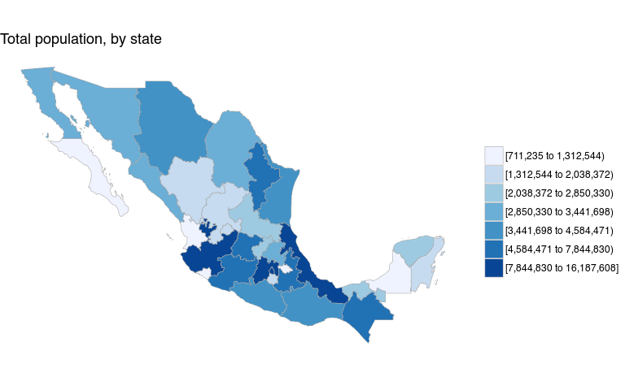
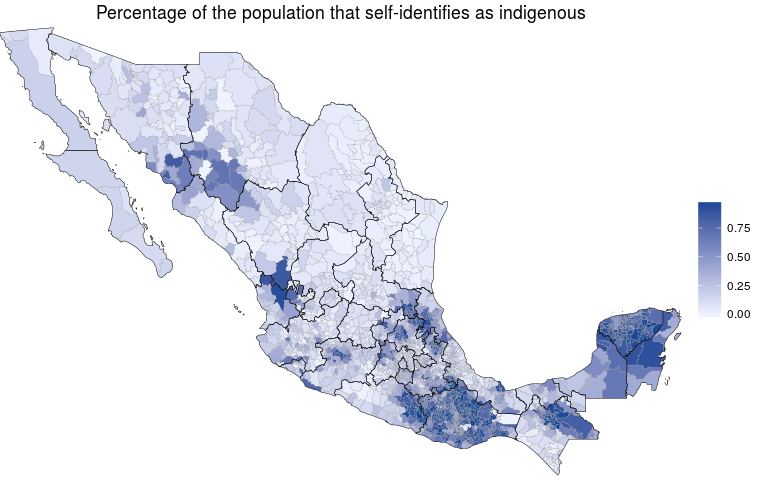

Mexico Choropleths
================
Diego Valle-Jones
February 11, 2016

-   [What does it do?](#what-does-it-do)
-   [Installation](#installation)
-   [Quick Example](#quick-example)
-   [Data](#data)
-   [Municipios](#municipios)

[](https://travis-ci.org/diegovalle/mxmaps) [](https://travis-ci.org/diegovalle/mxmaps) [](https://coveralls.io/github/diegovalle/mxmaps?branch=master)

<table style="width:43%;">
<colgroup>
<col width="20%" />
<col width="22%" />
</colgroup>
<tbody>
<tr class="odd">
<td align="left"><strong>Author:</strong></td>
<td align="left">Diego Valle-Jones</td>
</tr>
<tr class="even">
<td align="left"><strong>License:</strong></td>
<td align="left"><a href="https://opensource.org/licenses/BSD-3-Clause">BSD_3</a></td>
</tr>
<tr class="odd">
<td align="left"><strong>Status:</strong></td>
<td align="left">alpha</td>
</tr>
<tr class="even">
<td align="left"><strong>Website:</strong></td>
<td align="left"><a href="https://www.diegovalle.net/mxmaps/" class="uri">https://www.diegovalle.net/mxmaps/</a></td>
</tr>
</tbody>
</table>

What does it do?
----------------

This package is based on [choroplethr](https://cran.r-project.org/web/packages/choroplethr/index.html) and can be used to easily create maps of Mexico at both the state and municipio levels. It also includes functions to create interactive maps using the leaflet package, map INEGI data from its [API](https://cran.r-project.org/web/packages/inegiR/inegiR.pdf), and format strings so they match the INEGI state and municipio codes. Be sure to visit the [official website](https://www.diegovalle.net/mxmaps/).

Installation
------------

For the moment this package is only available from github. For the development version:

``` r
if (!require(devtools)) {
    install.packages("devtools")
}
devtools::install_github('diegovalle/mxmaps')
```

Quick Example
-------------

``` r
library(mxmaps)

data("df_mxstate")
df_mxstate$value <- df_mxstate$pop
mxstate_choropleth(df_mxstate,
                    title = "Total population, by state") 
```

<!-- -->

Data
----

The data.frame that you provide to the plotting functions must have one column named "region" and one column named "value". The entries for "region" must match the INEGI codes for states ("01", "02", etc) and municipios ("01001", "01002", etc) either as a string with or without a leading "0" or as numerics. The functions `str_mxstate` and `str_mxmunicipio` are provided to easily format codes to the INEGI specification. Also, two example data.frames, `df_mxstate` and `df_mxmunicipio`, are provided with demographic variables from the Encuesta Intercensal 2015.

``` r
data("df_mxstate")
knitr::kable(head(df_mxstate))
```

| region | state\_name         | state\_name\_official | state\_abbr | state\_abbr\_official |      pop|  pop\_male|  pop\_female|  afromexican|  part\_afromexican|  indigenous|  part\_indigenous|
|:-------|:--------------------|:----------------------|:------------|:----------------------|--------:|----------:|------------:|------------:|------------------:|-----------:|-----------------:|
| 01     | Aguascalientes      | Aguascalientes        | AGS         | Ags.                  |  1312544|     640091|       672453|          653|               4559|      153395|             18716|
| 02     | Baja California     | Baja California       | BC          | BC                    |  3315766|    1650341|      1665425|         7445|              10432|      283055|             38391|
| 03     | Baja California Sur | Baja California Sur   | BCS         | BCS                   |   712029|     359137|       352892|        11032|               5132|      103034|             11728|
| 04     | Campeche            | Campeche              | CAMP        | Camp.                 |   899931|     441276|       458655|         3554|               6833|      400811|             13140|
| 05     | Coahuila            | Coahuila de Zaragoza  | COAH        | Coah.                 |  2954915|    1462612|      1492303|         2761|               8137|      204890|             28588|
| 06     | Colima              | Colima                | COL         | Col.                  |   711235|     350791|       360444|          762|               3314|      145297|             12373|

``` r
data("df_mxmunicipio")
knitr::kable(head(df_mxmunicipio))
```

| region | state\_code | state\_name    | state\_name\_official | state\_abbr | state\_abbr\_official | municipio\_code | municipio\_name     |     pop|  pop\_male|  pop\_female|  afromexican|  part\_afromexican|  indigenous|  part\_indigenous| metro\_area    |
|:-------|:------------|:---------------|:----------------------|:------------|:----------------------|:----------------|:--------------------|-------:|----------:|------------:|------------:|------------------:|-----------:|-----------------:|:---------------|
| 01001  | 01          | Aguascalientes | Aguascalientes        | AGS         | Ags.                  | 001             | Aguascalientes      |  877190|     425731|       451459|          532|               2791|      104125|             14209| Aguascalientes |
| 01002  | 01          | Aguascalientes | Aguascalientes        | AGS         | Ags.                  | 002             | Asientos            |   46464|      22745|        23719|            3|                130|        1691|                92| NA             |
| 01003  | 01          | Aguascalientes | Aguascalientes        | AGS         | Ags.                  | 003             | Calvillo            |   56048|      27298|        28750|           10|                167|        7358|              2223| NA             |
| 01004  | 01          | Aguascalientes | Aguascalientes        | AGS         | Ags.                  | 004             | Cosío               |   15577|       7552|         8025|            0|                 67|        2213|               191| NA             |
| 01005  | 01          | Aguascalientes | Aguascalientes        | AGS         | Ags.                  | 005             | Jesús María         |  120405|      60135|        60270|           32|                219|        8679|               649| Aguascalientes |
| 01006  | 01          | Aguascalientes | Aguascalientes        | AGS         | Ags.                  | 006             | Pabellón de Arteaga |   46473|      22490|        23983|            3|                 74|        6232|               251| NA             |

Municipios
----------

Here's another example of Mexican municipios (similar to counties):

``` r
data("df_mxmunicipio")
df_mxmunicipio$value <-  df_mxmunicipio$indigenous / df_mxmunicipio$pop 
mxmunicipio_choropleth(df_mxmunicipio, num_colors = 1,
                       title = "Percentage of the population that self-identifies as indigenous")
```

<!-- -->
