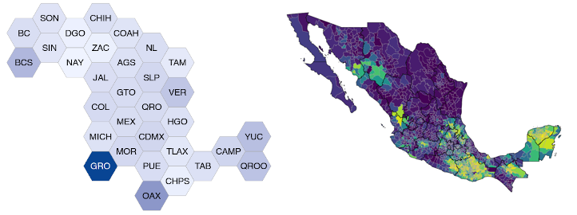

```{r setup, include=FALSE}
knitr::opts_chunk$set(echo = TRUE, 
                      fig.dim = c(8, 5), 
                      dpi = 200, 
                      out.width = '100%')
```

# mxmaps - create maps of Mexico

[](https://github.com/diegovalle/mxmaps/actions)
[](https://coveralls.io/github/diegovalle/mxmaps?branch=master) 
[](https://www.tidyverse.org/lifecycle/#maturing)



This R package easily creates choropleth maps of Mexico at both the state and municipio levels. It is based on the [choroplethr](https://cran.r-project.org/web/packages/choroplethr/index.html) package and includes functions to create interactive maps with Leaflet, and to format strings to match INEGI state and municipio codes. If you have questions, please visit the [discussion forum](https://groups.google.com/forum/#!forum/mxmaps).

## Installation

This package is currently only available on GitHub. To install, run the following command:

```r
if (!require("devtools")) {
    install.packages("devtools")
}
devtools::install_github("diegovalle/mxmaps")
```

Note: `mxmaps` depends on the `sf` package, which has its own [system dependencies](https://github.com/r-spatial/sf/#windows).

## Quick Example

```{r head, fig.dim = c(8, 5)}
library("mxmaps")

df_mxstate_2020$value <- df_mxstate_2020$pop
mxstate_choropleth(df_mxstate_2020,
                   title = "Total population, by state")
```

Here is a preview of the data format:

```{r}
knitr::kable(head(df_mxstate_2020[,c("region", "value")]))
```

## Basic Usage

The two main functions in this package are `mxstate_choropleth` and `mxmunicipio_choropleth`. The `data.frame` provided to these functions must contain a `region` column with INEGI state or municipio codes, and a `value` column with the values to plot. You can set the map's title with the `title` parameter and the number of color buckets with the `num_colors` parameter. To use a continuous color scale, set `num_colors = 1`.

```{r}
library("mxmaps")

df_mxstate_2020$value <-  df_mxstate_2020$indigenous_language / 
  df_mxstate_2020$pop * 100
mxstate_choropleth(df_mxstate_2020, 
                   num_colors = 1,
                   title = "Percentage of the population that speaks\nan indigenous language",
                   legend = "%")
```

## Municipios

You can also plot data for Mexican municipios (which are similar to US counties).

```{r}
data("df_mxmunicipio_2020")
df_mxmunicipio_2020$value <-  df_mxmunicipio_2020$indigenous_language / 
  df_mxmunicipio_2020$pop * 100
mxmunicipio_choropleth(df_mxmunicipio_2020, 
                       num_colors = 1,
                       title = "Percentage of the population that speaks\nan indigenous language",
                       legend = "%")

```

You can also zoom in on specific areas of the map by passing a vector of `region` codes to the `zoom` parameter:

```{r}

mxmunicipio_choropleth(df_mxmunicipio_2020, num_colors = 1,
                       zoom = subset(df_mxmunicipio_2020, metro_area %in% 
                                       c("Valle de México",
                                         "Puebla-Tlaxcala",
                                         "Cuernavaca",
                                         "Toluca"))$region,
                       title = "Percentage of the population that speaks\nan indigenous language",
                       legend = "%")
```

The `show_states` parameter allows you to hide state borders on municipio-level maps.

```{r}
mxmunicipio_choropleth(df_mxmunicipio_2020, num_colors = 1,
                       zoom = subset(df_mxmunicipio_2020, state_name %in% 
                                       c("Yucatán", "Veracruz"))$region,
                       title = "Percentage of the population that speaks\nan indigenous language in Yucatán and Veracruz",
                       show_states = FALSE,
                       legend = "%")
```
